# Comexio — Configuration Guide

🌍 *[🇩🇪 Auf Deutsch lesen (Read this in German)](#-deutsch)*

---

## Table of Contents

1. [Initial Setup](#1-initial-setup)
2. [Integration Overview](#2-integration-overview)
3. [Settings](#3-settings)
4. [Reconfigure Connection](#4-reconfigure-connection)
5. [WebIO Sync](#5-webio-sync)
6. [Initial Repair](#6-initial-repair)

---

## 1. Initial Setup

Navigate to **Settings → Devices & Services → Add Integration** and search for **Comexio**.

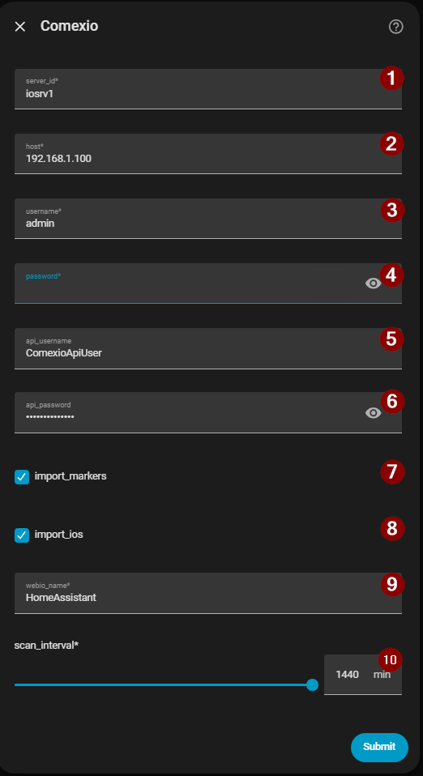

| Field | Description |
|-------|-------------|
| **① Instance Name** | Unique prefix for all entity IDs (e.g. `iosrv1`). Cannot be changed after setup. |
| **② Host / IP** | IP address or hostname of your Comexio IO-Server. |
| **③ Username** | Admin UI username (default: `admin`). |
| **④ Password** | Admin UI password. |
| **⑤ API Username** | Basic Auth username for fast value writes (optional). |
| **⑥ API Password** | Basic Auth password (optional). |
| **⑦ Create marker entities** | Import Comexio Markers as HA entities. |
| **⑧ Create IO entities** | Import physical IOs as HA entities. |
| **⑨ Device class name** | Name of the Web-IO device class created in Comexio (default: `HomeAssistant`). |
| **⑩ Polling interval** | Background polling interval in minutes. |

After a successful login test, HA confirms the new device:

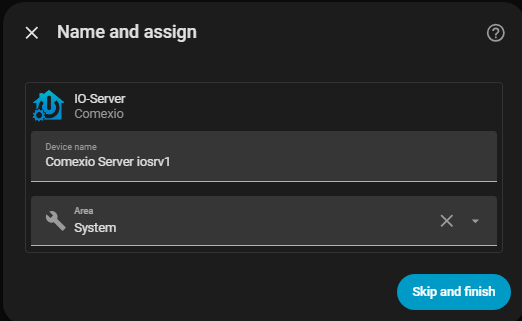

---

## 2. Integration Overview

After setup the integration appears under **Settings → Devices & Services → Comexio**.

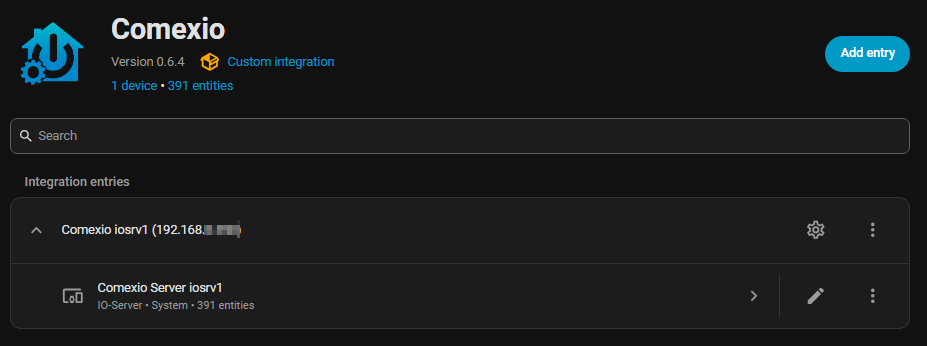

The entry shows the instance name, IP address, device count, and entity count. The ⚙️ icon opens [Settings](#3-settings); the ⋮ menu contains **Reconfigure** and **Reload**.

---

## 3. Settings

Open via the **⚙️ icon** on the integration entry. Contains non-credential options only — connection details are managed separately via [Reconfigure](#4-reconfigure-connection).

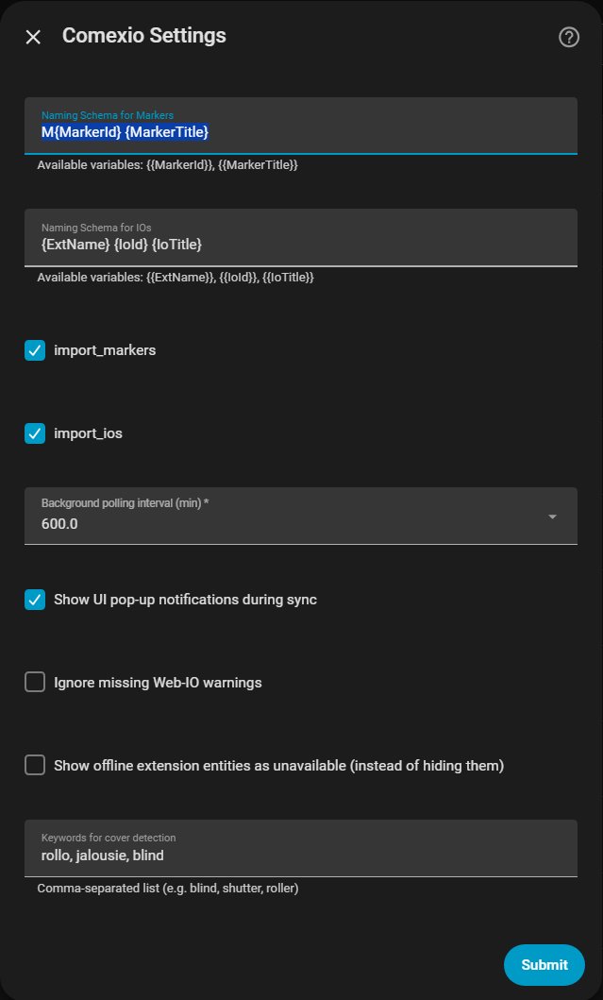

| Field | Description |
|-------|-------------|
| **Naming schema — Markers** | Template for entity names. Variables: `{MarkerId}`, `{MarkerTitle}` |
| **Naming schema — IOs** | Template for entity names. Variables: `{ExtName}`, `{IoId}`, `{IoTitle}` |
| **Create marker entities** | Enable/disable Marker import. |
| **Create IO entities** | Enable/disable IO import. |
| **Polling interval** | Dropdown (1 – 1440 min). Prefer longer intervals — live values arrive via webhook. |
| **Show sync notifications** | Display pop-up progress messages during WebIO sync. |
| **Ignore Web-IO warnings** | Suppress the Repair issue when the Web-IO class is out of sync. |
| **Show offline extension entities** | Show entities of offline modules as *Unavailable* instead of hiding them. |
| **Cover detection keywords** | Comma-separated keywords to classify IOs as covers (e.g. `blind, shutter, roller`). |

---

## 4. Reconfigure Connection

Open via **⋮ → Reconfigure** on the integration entry. Allows updating host, username, and passwords without re-adding the integration.

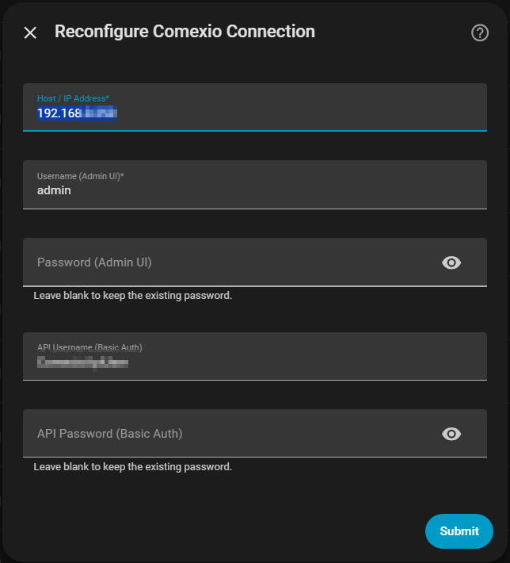

> **Tip:** Leave password fields blank to keep the existing password. The integration runs a connection test before saving and reloads automatically on success.

---

## 5. WebIO Sync

The integration creates and manages a *Web-IO* device class in Comexio automatically. The sync controls are exposed as diagnostic entities on the hub device.

**Idle state — ready to sync:**

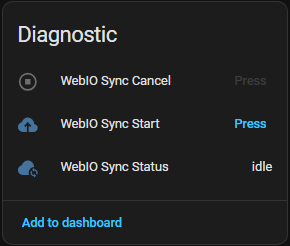

**Active state — sync in progress:**

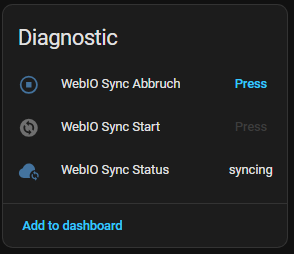

| Entity | Description |
|--------|-------------|
| **WebIO Sync Start** | Triggers a delta or full-recreate sync. Unavailable while a sync is running. |
| **WebIO Sync Cancel** | Cancels an in-progress sync. Only active during a running sync. |
| **WebIO Sync Status** | Sensor reporting `idle`, `syncing`, or `error`. |

**Entity state details (developer tools):**

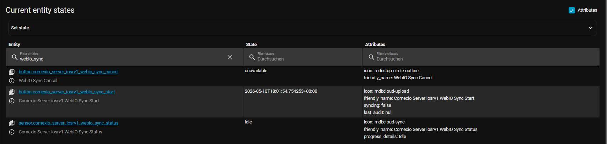

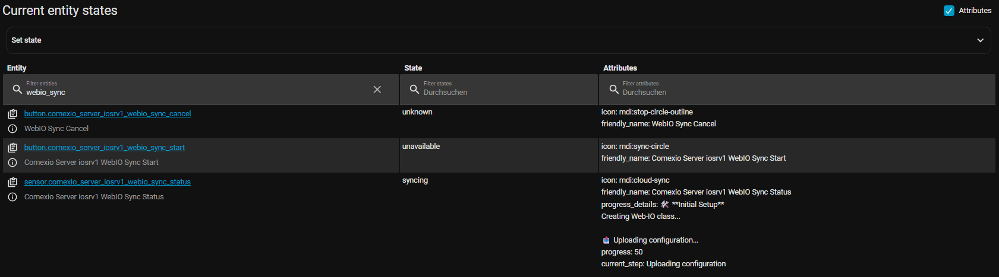

---

## 6. Initial Repair

When the integration starts for the first time — or the Web-IO class is missing in Comexio — a **Repair issue** appears automatically:

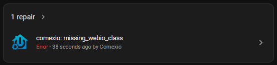

Confirming the repair creates the Web-IO device class and all webhook commands in Comexio. A notification tracks progress:

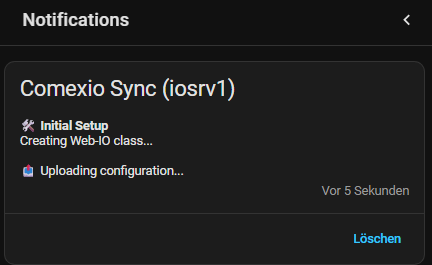

A final notification confirms success with the elapsed time:

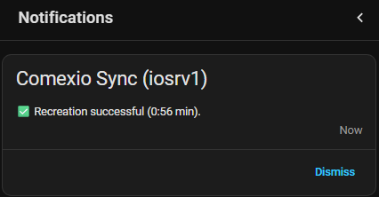

---

*[← Back to README](README.md)*

---

# 🇩🇪 Deutsch

🌍 *[🇬🇧 Read this in English](#comexio--configuration-guide)*

---

## Inhaltsverzeichnis

1. [Ersteinrichtung](#1-ersteinrichtung)
2. [Integrationsübersicht](#2-integrationsübersicht)
3. [Einstellungen](#3-einstellungen)
4. [Verbindung neu konfigurieren](#4-verbindung-neu-konfigurieren)
5. [WebIO Sync](#5-webio-sync-1)
6. [Ersteinrichtung (Reparatur)](#6-ersteinrichtung-reparatur)

---

## 1. Ersteinrichtung

Navigiere zu **Einstellungen → Geräte & Dienste → Integration hinzufügen** und suche nach **Comexio**.

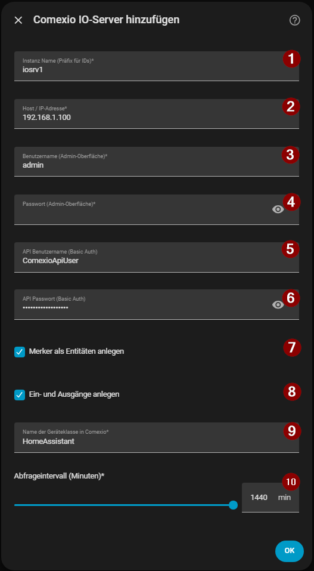

| Feld | Beschreibung |
|------|--------------|
| **① Instanz Name** | Eindeutiger Präfix für alle Entity-IDs (z. B. `iosrv1`). Kann nach dem Setup nicht geändert werden. |
| **② Host / IP-Adresse** | IP-Adresse oder Hostname des Comexio IO-Servers. |
| **③ Benutzername** | Benutzername für die Admin-Oberfläche (Standard: `admin`). |
| **④ Passwort** | Passwort für die Admin-Oberfläche. |
| **⑤ API Benutzername** | Basic-Auth-Benutzername für schnelle API-Schreibzugriffe (optional). |
| **⑥ API Passwort** | Basic-Auth-Passwort (optional). |
| **⑦ Merker als Entitäten anlegen** | Comexio-Merker als HA-Entitäten importieren. |
| **⑧ Ein- und Ausgänge anlegen** | Physische IOs als HA-Entitäten importieren. |
| **⑨ Name der Geräteklasse** | Name der Web-IO-Geräteklasse in Comexio (Standard: `HomeAssistant`). |
| **⑩ Abfrageintervall** | Hintergrund-Polling-Intervall in Minuten. |

Nach erfolgreichem Login-Test bestätigt HA die Anlage des neuen Geräts:

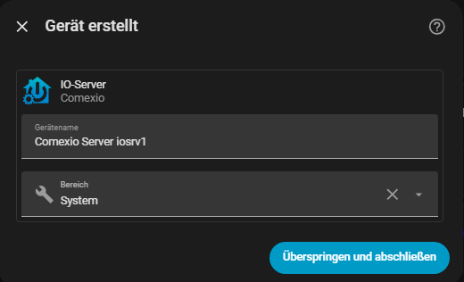

---

## 2. Integrationsübersicht

Nach dem Setup erscheint die Integration unter **Einstellungen → Geräte & Dienste → Comexio**.

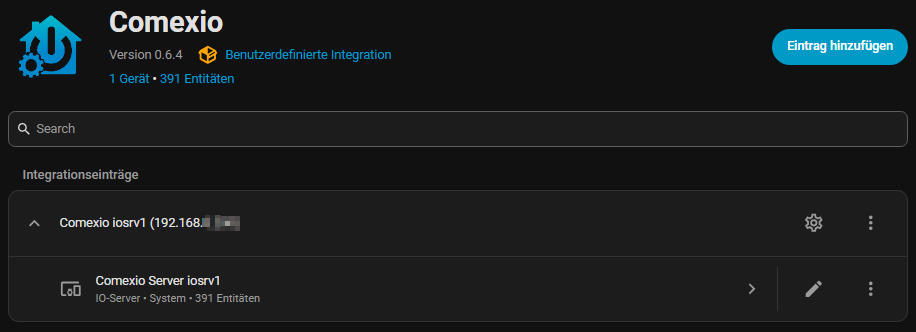

Der Eintrag zeigt Instanzname, IP-Adresse, Geräteanzahl und Entitätenanzahl. Das ⚙️-Icon öffnet die [Einstellungen](#3-einstellungen); das ⋮-Menü enthält **Neu konfigurieren** und **Neu laden**.

---

## 3. Einstellungen

Öffnen über das **⚙️-Icon** am Integrationseintrag. Enthält ausschließlich nicht-sicherheitskritische Optionen — Verbindungsdaten werden separat über [Neu konfigurieren](#4-verbindung-neu-konfigurieren) verwaltet.

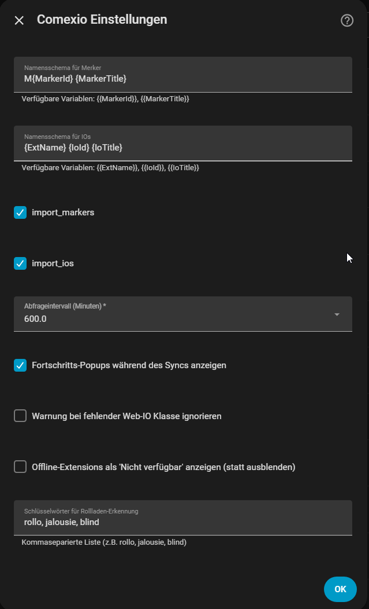

| Feld | Beschreibung |
|------|--------------|
| **Namensschema — Merker** | Vorlage für Entity-Namen. Variablen: `{MarkerId}`, `{MarkerTitle}` |
| **Namensschema — IOs** | Vorlage für Entity-Namen. Variablen: `{ExtName}`, `{IoId}`, `{IoTitle}` |
| **Merker als Entitäten anlegen** | Merker-Import aktivieren/deaktivieren. |
| **Ein- und Ausgänge anlegen** | IO-Import aktivieren/deaktivieren. |
| **Abfrageintervall** | Dropdown (1 – 1440 min). Längere Intervalle bevorzugen — Live-Werte kommen per Webhook. |
| **Fortschritts-Popups anzeigen** | Fortschrittsmeldungen während des WebIO-Syncs anzeigen. |
| **Web-IO-Warnung ignorieren** | Reparatur-Issue unterdrücken, wenn die Web-IO-Klasse nicht synchron ist. |
| **Offline-Extensions anzeigen** | Entitäten offline gegangener Module als *Nicht verfügbar* anzeigen statt ausblenden. |
| **Schlüsselwörter Rollladen-Erkennung** | Kommaseparierte Liste zur Klassifizierung von IOs als Abdeckungen (z. B. `rollo, jalousie, blind`). |

---

## 4. Verbindung neu konfigurieren

Öffnen über **⋮ → Neu konfigurieren** am Integrationseintrag. Erlaubt das Ändern von Host, Benutzername und Passwörtern ohne Neueinrichtung der Integration.

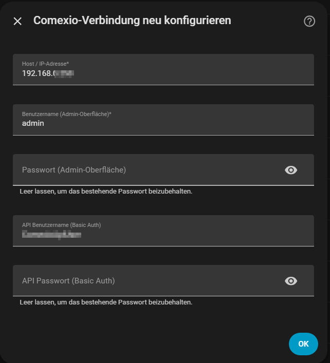

> **Tipp:** Passwortfelder leer lassen bedeutet "bestehendes Passwort beibehalten". Die Integration führt vor dem Speichern einen Verbindungstest durch und lädt sich bei Erfolg automatisch neu.

---

## 5. WebIO Sync

Die Integration erstellt und verwaltet eine *Web-IO*-Geräteklasse in Comexio vollautomatisch. Die Sync-Steuerung ist über Diagnose-Entitäten am Hub-Gerät zugänglich.

**Ruhezustand — bereit:**

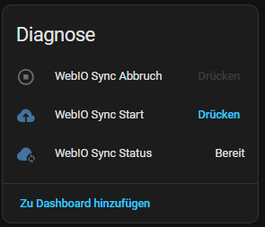

**Aktiver Sync:**

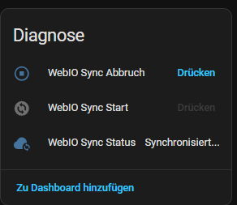

| Entität | Beschreibung |
|---------|--------------|
| **WebIO Sync Start** | Startet einen Delta- oder Full-Recreate-Sync. Während des Syncs nicht verfügbar. |
| **WebIO Sync Abbruch** | Bricht einen laufenden Sync ab. Nur während eines aktiven Syncs verfügbar. |
| **WebIO Sync Status** | Sensor mit den Zuständen `idle`, `syncing` oder `error`. |

**Entitätszustände (Entwickler-Werkzeuge):**

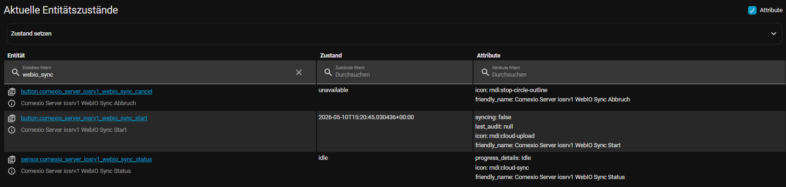

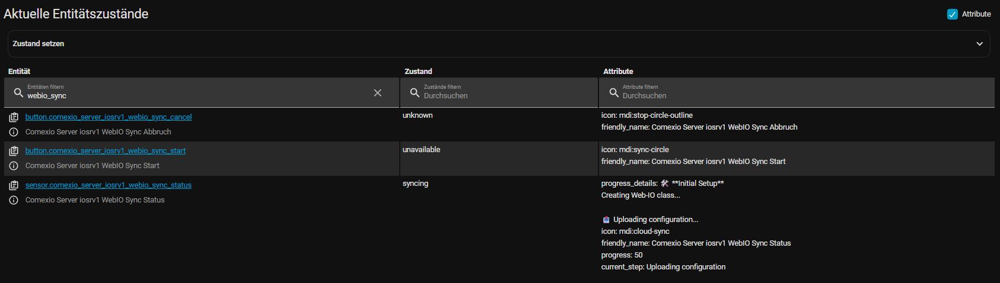

---

## 6. Ersteinrichtung (Reparatur)

Wenn die Integration zum ersten Mal startet — oder die Web-IO-Klasse in Comexio fehlt — wird automatisch ein **Reparatur-Issue** erstellt:

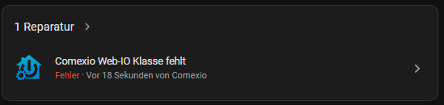

Nach Bestätigung wird die Web-IO-Geräteklasse samt aller Webhook-Befehle in Comexio angelegt. Eine Benachrichtigung zeigt den Fortschritt:

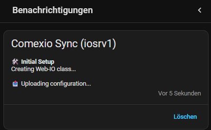

Eine abschließende Meldung bestätigt den Erfolg mit der benötigten Zeit:

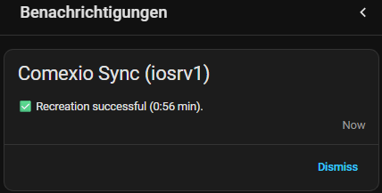

---

*[← Zurück zur README](README.md)*
