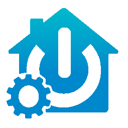

#  Comexio Integration for Home Assistant

🌍 *[🇩🇪 Auf Deutsch lesen (Read this in German)](#-deutsch)*

This custom integration seamlessly and locally connects **Comexio IO-Servers** to Home Assistant. It was designed to build a high-performance, real-time bridge between the Comexio logic world and Home Assistant. The focus is on blazing-fast speed (Local Push) and fully automated, intelligent interface management.

## ❤️ Support
This integration is actively maintained and updated in my spare time.

If it has helped you, consider supporting ongoing development, bug fixes, compatibility updates, and future enhancements:

- ❤️ GitHub Sponsors: https://github.com/sponsors/kayl-codes
- ☕ Buy Me a Coffee: https://buymeacoffee.com/kayl74

Every contribution is greatly appreciated. Thank you for your support!

## ✨ Core Features

- ⚡ **Real-Time Status (Local Push):** Uses Home Assistant Webhooks and dynamically generated LUA scripts in Comexio. Status changes of inputs/outputs and markers are pushed to Home Assistant without delay (no polling).
- 🤖 **Smart Web-IO Lifecycle Management:** Automatically detects missing webhooks in Comexio and offers to create, repair, or clean them up directly via the HA dashboard.
- 🔄 **Deep Delta-Sync:** If a name or type changes in Comexio, an intelligent comparison updates *only* the affected commands (delta), without breaking existing logic plans.
- 🛠️ **Integrated Repair Dialogs (HA Repairs):** In case of inconsistencies between HA and Comexio, the integration creates interactive repair suggestions directly in the HA dashboard.
- 📴 **Offline Extension Handling:** When a Comexio extension module goes offline, all its entities and its sub-device are automatically removed from the HA device list. A diagnostic sensor on the hub device shows which extensions are currently offline.
- 🔒 **Secure Authentication:** Full support for the modern RSA login method (v11) for administrative tasks as well as Basic Auth for standard API calls.

## 📦 Supported Entities

| Platform | Comexio Source | Features |
| :--- | :--- | :--- |
| `sensor` | Analog IOs (QI, TL, AI) | Automatic detection of temperature (°C), power (W), current (A), etc. via `$ioTypes`. |
| `binary_sensor` | Digital Inputs | Auto-detection of motion detectors, window and door contacts based on the name. |
| `switch` | Digital Outputs (Q) & Markers | Switches physical relays (classified as outlets) and digital markers. |
| `number` | Analog Markers | Sets setpoints with automatic range checking (e.g., target temperature). |
| `button` | System Functions | Manual "Smart-Sync" trigger and cancel button directly from the HA device view. |
| `sensor` (diagnostic) | Integration | `Offline Extensions` — shows how many extension modules are currently offline and lists their names as a state attribute. |

## 🚀 Installation

### Option 1: HACS (Recommended)
Since this integration is not (yet) in the standard HACS store, you can add it as a custom repository:
1. Go to **HACS** > **Integrations**.
2. Click the three dots in the top right corner and select **Custom repositories**.
3. Add the URL of this GitHub repository and select the category **Integration**.
4. Click Download and restart Home Assistant.

### Option 2: Manual
1. Download this repository as a ZIP file.
2. Copy the `comexio` folder into your `custom_components` directory of Home Assistant.
3. Restart Home Assistant.

## ⚙️ Configuration (Setup)

1. In Home Assistant, go to **Settings > Devices & Services**.
2. Click **Add Integration** in the bottom right corner and search for **Comexio**.
3. Fill in your connection details:
   - **Host:** IP address of your Comexio server.
   - **Username / Password:** Your credentials for the web interface (Admin).
   - **API User / Pass (Optional):** For faster API calls via Basic Auth.
4. After the setup, the integration logs into Comexio and downloads the configuration.

> [!TIP]
> **Initial Setup:** When the integration starts for the first time, it will propose to automatically create the Web-IO device class in Comexio via the Home Assistant "Repairs" menu. Confirm this to activate full webhook functionality!

> [!TIP]
> **Changing connection details later:** If your Comexio IP address or passwords change, you do **not** need to re-add the integration. Open *Settings → Devices & Services → Comexio → ⋮ → Reconfigure* and update host, username, and passwords directly. Leave password fields blank to keep the existing password.

> [!NOTE]
> **Settings (⚙️)** — The gear icon opens non-security options: entity naming schemas, import flags, polling interval, notifications, and cover detection keywords.

📖 **[Full configuration guide with screenshots →](CONFIGURATION.md)**

## 🧠 Smart Lifecycle Management (How it works)

The integration manages the interface to Comexio completely autonomously. The system consists of three phases:

### 1️⃣ Periodic Audit (Consistency Check)
The *Data Update Coordinator* regularly checks in the background whether the configuration in HA still matches the Web-IO commands created in Comexio 100%.

### 2️⃣ Detection of Mismatches
If you adjust the logic in Comexio, HA detects this immediately and classifies the issue:
- ➕ **Missing:** An IO/Marker exists but doesn't have a webhook in Comexio yet.
- ✏️ **Rename:** A name was changed in Comexio, but the webhook still has the old name.
- 🔧 **Type Mismatch:** A type (Digital/Analog) has changed.
- 🗑️ **Orphan:** A webhook refers to a device that has long been deleted.
- 🌐 **IP Mismatch:** The IP of your HA server has changed.

### 3️⃣ Manual Repair (Delta Sync)
Instead of blindly overwriting everything (which might break your Comexio logic), HA creates a **Repair Issue**.
You can then decide via click whether you want to perform a **Full Sync** or a targeted **Delta-Sync** (e.g., "Only delete orphans"). The integration pauses between write operations (`asyncio.sleep`) to avoid overloading the Comexio server.

## 📴 Offline Extension Handling

If a Comexio extension module (e.g. an RC or UD bus device) is offline or not reachable, the integration detects this automatically during the next coordinator poll and takes the following actions:

1. **Entities removed:** All sensors, switches, and binary sensors belonging to the offline extension are removed from the HA entity registry.
2. **Sub-device removed:** The extension's sub-device is deleted from the HA device list so no stale "Unavailable" card remains.
3. **Diagnostic sensor updated:** The `Offline Extensions` sensor on the hub device increments its count and lists the offline extension names in its `extensions` attribute.

When the extension comes back online, a full HA restart or integration reload will re-create all its entities and sub-device automatically.

> [!NOTE]
> Detection works by checking the `Identifier` field returned by the Comexio API. An online extension returns a serial number (e.g. `8505-2057-2326`), while an offline one only returns its model code (e.g. `5010`) without dashes.

## 🐛 Troubleshooting

- **"Web-IO device is blocked (in use)":** You are trying to do a *Full Sync*, but the Web-IO device is already connected in a logic plan in Comexio. The integration detects this and falls back automatically and safely to the *Delta-Sync* to patch only individual commands.
- **No updates in HA (Webhooks don't arrive):** Make sure that the IP address stored in Comexio matches HA. If the HA IP has changed, you will be offered the "Update IP" option in the repair menu.
- **Extension entities don't reappear after coming back online:** Reload the integration via *Settings → Devices & Services → Comexio → ⋮ → Reload*. The coordinator will re-detect the extension as online and restore all its entities.

## 🤝 Contributing
Pull Requests are highly welcome! If you find bugs or have feature requests, please create an issue in the GitHub repository.

## 📄 License
This project is licensed under the MIT License.

---

# 🇩🇪 Deutsch

🌍 *[🇬🇧 Read this in English](#comexio-integration-for-home-assistant)*

#  Comexio Integration für Home Assistant

Diese Custom Integration bindet **Comexio IO-Server** nahtlos und lokal in Home Assistant ein. Sie wurde entwickelt, um eine performante, echtzeitfähige Brücke zwischen der Comexio-Logikwelt und Home Assistant zu schlagen. Der Fokus liegt auf rasanter Geschwindigkeit (Local Push) und einer vollständig automatisierten, intelligenten Verwaltung der Schnittstelle.

## ❤️ Support
Diese Integration wird aktiv in meiner Freizeit gewartet und weiterentwickelt.

Wenn sie dir geholfen hat, freue ich mich über deine Unterstützung für laufende Entwicklung, Bugfixes, Kompatibilitätsupdates und neue Features:

- ❤️ GitHub Sponsors: https://github.com/sponsors/kayl-codes
- ☕ Buy Me a Coffee: https://buymeacoffee.com/kayl74

Jede Unterstützung wird sehr geschätzt. Danke!

## ✨ Kern-Features

- ⚡ **Echtzeit-Status (Local Push):** Nutzt Home Assistant Webhooks und dynamisch generierte LUA-Skripte in Comexio. Statusänderungen von Ein-/Ausgängen und Merkern werden ohne Verzögerung (Polling) an Home Assistant gepusht.
- 🤖 **Smartes Web-IO Lifecycle Management:** Erkennt fehlende Webhooks in Comexio automatisch und bietet im HA-Dashboard an, diese anzulegen, zu reparieren oder zu bereinigen.
- 🔄 **Deep Delta-Sync:** Ändert sich ein Name oder Typ in Comexio, aktualisiert ein intelligenter Abgleich *nur* die betroffenen Befehle (Delta), ohne bestehende Logikpläne zu zerstören.
- 🛠️ **Integrierte Reparatur-Dialoge (HA Repairs):** Bei Unstimmigkeiten zwischen HA und Comexio erstellt die Integration interaktive Reparatur-Vorschläge direkt im HA-Dashboard.
- 📴 **Offline-Extension-Erkennung:** Geht ein Comexio-Erweiterungsmodul offline, werden alle zugehörigen Entitäten und das Sub-Device automatisch aus der HA-Geräteliste entfernt. Ein Diagnose-Sensor am Hub-Device zeigt, welche Module gerade offline sind.
- 🔒 **Sichere Authentifizierung:** Volle Unterstützung für das moderne RSA-Login-Verfahren (v11) für administrative Aufgaben sowie Basic Auth für Standard-API-Aufrufe.

## 📦 Unterstützte Entitäten

| Plattform | Comexio Quelle | Features |
| :--- | :--- | :--- |
| `sensor` | Analoge IOs (QI, TL, AI) | Automatische Erkennung von Temperatur (°C), Leistung (W), Strom (A), etc. via `$ioTypes`. |
| `binary_sensor` | Digitale Eingänge | Auto-Erkennung von Bewegungsmeldern, Fenster- und Türkontakten anhand des Namens. |
| `switch` | Digitale Ausgänge (Q) & Merker | Schaltet physische Relais (als Steckdose/Outlet klassifiziert) und digitale Merker. |
| `number` | Analoge Merker | Setzt Sollwerte (Setpoints) mit automatischer Bereichsprüfung (z. B. Temp-Soll). |
| `button` | System-Funktionen | Manueller "Smart-Sync" Abgleich und Abbruch direkt aus der HA-Geräteansicht. |
| `sensor` (Diagnose) | Integration | `Offline Extensions` — zeigt, wie viele Erweiterungsmodule gerade offline sind, und listet deren Namen als State-Attribut. |

## 🚀 Installation

### Option 1: HACS (Empfohlen)
Da diese Integration (noch) nicht im Standard-HACS Store ist, kannst du sie als Custom Repository hinzufügen:
1. Gehe in HACS zu **Integrationen**.
2. Klicke oben rechts auf die drei Punkte und wähle **Benutzerdefinierte Repositorys**.
3. Füge die URL dieses GitHub-Repositories hinzu und wähle die Kategorie **Integration**.
4. Klicke auf Herunterladen und starte Home Assistant neu.

### Option 2: Manuell
1. Lade dir das Repository als ZIP herunter.
2. Kopiere den Ordner `comexio` in dein `custom_components` Verzeichnis von Home Assistant.
3. Starte Home Assistant neu.

## ⚙️ Konfiguration (Setup)

1. Gehe in Home Assistant zu **Einstellungen > Geräte & Dienste**.
2. Klicke unten rechts auf **Integration hinzufügen** und suche nach **Comexio**.
3. Fülle die Verbindungsdaten aus:
   - **Host:** IP-Adresse deines Comexio-Servers.
   - **Benutzername / Passwort:** Deine Zugangsdaten für die Weboberfläche (Admin).
   - **API User / Pass (Optional):** Für schnellere API-Aufrufe via Basic Auth.
4. Nach dem Setup meldet sich die Integration in Comexio an und lädt die Konfiguration herunter.

> [!TIP]
> **Verbindungsdaten nachträglich ändern:** Wenn sich IP-Adresse oder Passwörter ändern, musst du die Integration **nicht** neu einrichten. Öffne die Integration unter *Einstellungen → Geräte & Dienste → Comexio → ⋮ → Neu konfigurieren* und passe Host, Benutzername und Passwörter direkt an. Felder für Passwörter leer lassen bedeutet "bestehendes Passwort beibehalten".

> [!NOTE]
> **Einstellungen (⚙️)** — Über das Zahnrad-Icon der Integration erreichst du nicht-sicherheitskritische Optionen: Namensschemas für Entities, Import-Flags, Poll-Intervall, Benachrichtigungen und Rollladen-Schlüsselwörter.

📖 **[Vollständige Konfigurationsanleitung mit Screenshots →](CONFIGURATION.md)**

> [!TIP]
> **Initial Setup:** Wenn die Integration das erste Mal startet, wird sie im Home Assistant Reparatur-Menü ("Repairs") vorschlagen, die Web-IO Geräteklasse in Comexio automatisch anzulegen. Bestätige dies, um die volle Webhook-Funktionalität zu aktivieren!

## 🧠 Smart Lifecycle Management (Wie es funktioniert)

Die Integration verwaltet die Schnittstelle zu Comexio komplett autonom. Das System besteht aus drei Phasen:

### 1️⃣ Periodischer Audit (Konsistenzprüfung)
Der *Data Update Coordinator* prüft im Hintergrund regelmäßig, ob die Konfiguration in HA noch zu 100 % mit den angelegten Web-IO Befehlen in Comexio übereinstimmt. 

### 2️⃣ Erkennung von Abweichungen (Mismatches)
Wenn du in Comexio Logik anpasst, erkennt HA das sofort und klassifiziert den Fehler:
- ➕ **Missing:** Ein IO/Merker existiert, hat aber noch keinen Webhook in Comexio.
- ✏️ **Rename:** Ein Name wurde in Comexio geändert, aber der Webhook heißt noch alt.
- 🔧 **Type Mismatch:** Ein Typ (Digital/Analog) hat sich geändert.
- 🗑️ **Orphan:** Ein Webhook verweist auf ein Gerät, das längst gelöscht wurde.
- 🌐 **IP Mismatch:** Die IP deines HA-Servers hat sich geändert.

### 3️⃣ Manuelle Reparatur (Delta Sync)
Anstatt blind alles zu überschreiben (und dabei womöglich deine Comexio-Logik zu beschädigen), erstellt HA ein **Reparatur-Issue**.
Du kannst dann per Klick entscheiden, ob du einen **Full Sync** oder einen **gezielten Delta-Sync** (z.B. "Nur Waisen löschen") durchführen möchtest. Die Integration pausiert zwischen den Schreibvorgängen (`asyncio.sleep`), um den Comexio-Server nicht zu überlasten.

## 📴 Offline-Extension-Erkennung

Wenn ein Comexio-Erweiterungsmodul (z. B. ein RC- oder UD-Bus-Gerät) offline oder nicht erreichbar ist, erkennt die Integration das automatisch beim nächsten Coordinator-Poll und handelt wie folgt:

1. **Entitäten entfernt:** Alle Sensoren, Schalter und Binär-Sensoren des Moduls werden aus der HA Entity Registry entfernt.
2. **Sub-Device entfernt:** Das Sub-Device des Moduls verschwindet aus der HA-Geräteliste — keine veraltete "Nicht verfügbar"-Karte.
3. **Diagnose-Sensor aktualisiert:** Der `Offline Extensions`-Sensor am Hub-Device erhöht seinen Zähler und listet die Namen der Offline-Module im `extensions`-Attribut.

Kommt das Modul wieder online, stellt ein Reload der Integration (*Einstellungen → Geräte & Dienste → Comexio → ⋮ → Neu laden*) alle Entitäten und das Sub-Device automatisch wieder her.

> [!NOTE]
> Die Erkennung basiert auf dem `Identifier`-Feld der Comexio-API. Ein Online-Modul liefert eine Seriennummer (z. B. `8505-2057-2326`), ein Offline-Modul nur den Geräte-Code ohne Bindestriche (z. B. `5010`).

## 🐛 Fehlerbehebung (Troubleshooting)

- **"Web-IO Gerät ist blockiert (in use)":** Du versuchst, einen *Full Sync* zu machen, aber das Web-IO Gerät ist in Comexio bereits in einem Logikplan verbunden. Die Integration erkennt das und fällt automatisch und sicher auf den *Delta-Sync* zurück, um nur die Einzelbefehle zu patchen.
- **Keine Updates in HA (Webhooks kommen nicht an):** Stelle sicher, dass die in Comexio hinterlegte IP-Adresse mit HA übereinstimmt. Falls sich die HA-IP geändert hat, wird dir im Reparatur-Menü die Option "Update IP" angeboten.
- **Extension-Entitäten erscheinen nach Wiederherstellung nicht:** Lade die Integration über *Einstellungen → Geräte & Dienste → Comexio → ⋮ → Neu laden* neu. Der Coordinator erkennt das Modul als online und legt alle Entitäten neu an.

## 🤝 Mitwirken
Pull Requests sind herzlich willkommen! Wenn du Fehler findest oder Feature-Wünsche hast, erstelle bitte ein Issue im GitHub Repository.

## 📄 Lizenz
Dieses Projekt steht unter der MIT-Lizenz.
